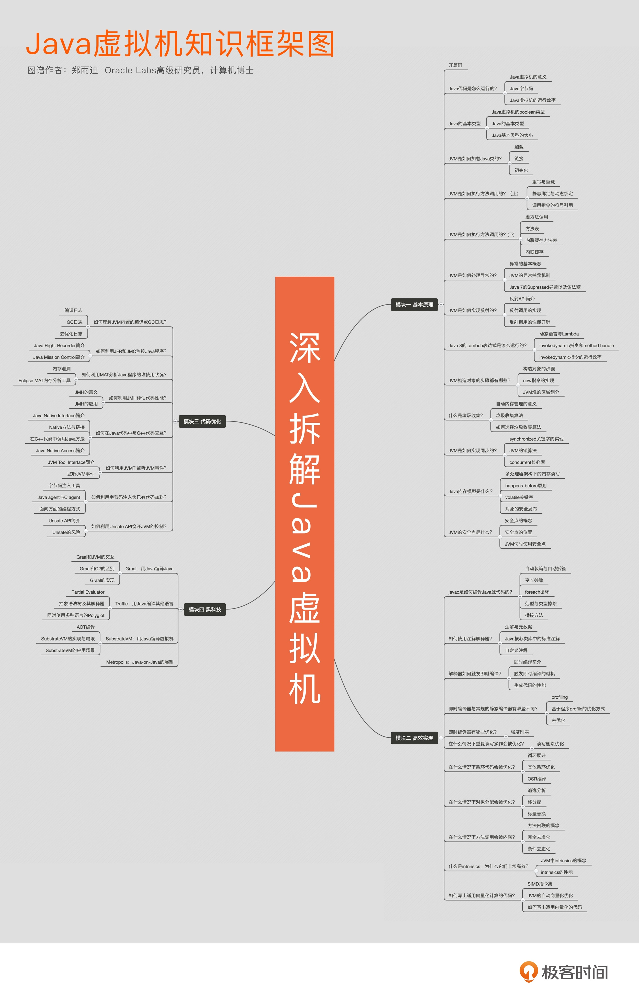

# 总览

## 基本原理

### Java代码运行过程

- 编码源文件 xx.java

- 通过ClassLoader加载源文件，得到xx.class, class文件里存储的是Java字节码

- 将字节码翻译成机器码，机器码宿主机可以直接运行；字节码翻译成机器码有以下两种方式

  - 解释执行，即逐条将字节码翻译成机器码并执行
  - 即时编译（Just-In-Time compilation，JIT），即将一个方法中包含的所有字节码编译成机器码后再执行。

  前者的优势在于无需等待编译，而后者的优势在于实际运行速度更快。HotSpot 默认采用混合模式，综合了解释执行和即时编译两者的优点。它会先解释执行字节码，而后将其中反复执行的热点代码，以方法为单位进行即时编译。

  HotSpot 内置了多个即时编译器：C1、C2 和 Graal

  HotSpot 默认采用分层编译的方式：热点方法首先会被 C1 编译，而后热点方法中的热点会进一步被 C2 编译。

## 垃圾收集器

两个维度看垃圾收集器

- 单线程（Serial）、 多线程(ParNew、Parallel Old)
- 串行、  并行（CMS、G1）

使用场景：

 串行多线程的收集器适合用在客户端程序，允许短暂的停顿，但是较快的完整来及回收

 并行多线程适合用在服务端，追求最短的停顿时间

### 安全点

为了快速的找到GCRoot,在HotSpot中使用一组OopMap的数据结构来记录栈和寄存器中哪些位置是引用；

但是导致OopMap变化的指令比较多，只有在特定位置更新OopMap,这个位置是安全点；安全点的选定是以是否具有让程序长时间执行的特征（如方法调用、循环跳转、异常跳转）；安全点代码的插入是JVM来判断然后插入的；

在查找GCRoot时，需要所有线程都到达安全点，然后STW,再找GCROOT

## 类的加载

类加载机制：虚拟机把描述类的数据从**class文件** （不是java文件，从java到class要经过编译）加载到内存，并对数据进行校验、转换解析和初始化，最终形成可以被虚拟机直接使用的Java类型

类加载器：通过一个类的全限定名来获取描述此类的二进制字节流

### 类加载时机

java虚拟机规范中并没有进行强制约束；但是对于初始化阶段，虚拟机规范各严格规定了有且只有5种情况必须立即对类进行初始化（而加载、验证、准备需要在此之前开始）

- 遇到new、getstatic、putstatic、invokestatic
- 使用java.lang.reflect包的方法对类进行反射调用的时候
- 当初始化一个类的时候，如果发现其父类还没进行过初始化，则先触发其父类的初始化
- 当虚拟机启动时，用户需要指定一个执行的主类
- 当使用JDK1.7的动态语言支持时，如果一个java.lang.invoke.MethodHandle实例最后的解析结果...

#### 加载器类型

- BootStrap ClassLoader(启动类加载器)

  只加载%JAVA_HOME/jre

- Extension ClassLoader(扩展类加载器)

  %JAVA_HOME/jre/lib/ext

- APP ClassLoader(应用类加载器,也称为系统类加载器)

  CLASSPATH下的类库

用户自定义加载器 继承 APP 继承 Extension 继承 BootStrap

需要自定义加载器的场景：

- 从非CLASSPATH路径加载文件
- 从网络的远程加载文件
- 加载加密文件

### 双亲委派加载机制（非强制性约束）

 	定义：一个类加载器收到了类的加载请求，它首先把这个请求委派给父类加载器去完成，只有父类无法完成这个加载请求，子加载器才会尝试加载（注：父类根据全限定类名判断自己是否加载过，加载过就返回成功，没有加载过加返回无法加载）

  好处：保证了Java程序的稳定运作；如：类java.lang.Object,它放在%JAVA_HOME/jre/lib/rt.jar包类，由启动类加载器加载，任意地方定义再定义java.lang.Oject，都是由启动类加载器加载，保证了Object类的唯一

  缺点：应用类加载器会顺着双亲路径往上判断,直到启动类加载器.但是启动类加载器不会往下询问,这个委托路线是单向的,即顶层的类加载器,无法访问底层的类加载器所加载的类。

### 打破双亲委派加载机制

JDBC(https://www.jianshu.com/p/09f73af48a98)、SPI

### 类的加载实例

#### Tomcat

- tomcat如何做到部署多个web应用时不产生类冲突的

  tomcat自定义多个类加载器完成隔离；如Common类加载器加载/common/*,CatalinaCalssLoader加载/server/ *,WebappClassLoader加载 /webapp/WEB-INF/*

- tomcat 怎么做到不需要依赖具体的web应用就能启动各种web应用的

  tomcat和web应用都遵循同一个Servet协议；这种设计原则满足依赖接口编程不依赖具体的实现

- tomcat如何启动web应用的

  tomcat的主类是BootStrap类,当有请求过来，通过请求的路径找到对应的web应用目录，找到httpServet类进行类的加载调用

## 虚拟机的性能监控和故障处理工具

### 影响性能的关键因素

thread control, disk I/O, database access, network I/O, and garbage collection (GC).

工具介绍：https://www.alibabacloud.com/blog/jprofiler-best-practices-powerful-performance-diagnostic-tool_594958

### JDK自带工具

- jps:虚拟机进程状况工具

- jstat:虚拟机统计信息监视工具

- jmap:java堆内存映像工具

  用于排查堆内存溢出问题

- jstack:java堆栈跟踪工具；https://juejin.im/post/5b31b510e51d4558a426f7e9

  - 用来查找死锁
  - 排查CPU使用率高，找到对应线程
  - 响应慢或无响应
  
- JVisual 界面工具

### JDK外更先进的分析工具

- 堆分析工具

​       MAT、Perfma、JProfiler

- 栈分析工具

  Perfma、JProfiler

### 通过字节码增强不修改代码查看线上问题工具

- btrace
- Alibaba/arthas  功能全、部署简单
- Qunar/bistoury  有图形化界面，部署起来复杂

### 监控工具

- SkyWalking

###问题排查思路

首先看系统的负载，

- 如果是内存高

  用jmap去dump堆内存，然后使用MAT分析可能的内存泄漏；具体到代码层面考虑以下点：

  - 是否一次在数据或者网络加载了过多的数据，
  - 是否存在了磁盘/网络IO没有关闭，
  - 是否有用到类似ThreadLocal和线程池一起用没有remove

- 如果是CPU过高，

  用jstack去dump线程，对比多次dump文件的runnable线程、或借助JProfiler分析死锁;具体代码层面考虑：

  - 是否有死循环
  - 递归的层次是否太深或者没有出口
  - 是否有死锁

- 如果CPU利用持续率走低,接口响应慢 
  - 是否存在磁盘/IO阻塞
  - 网络IO是否未设置超时时间一直等待
  - 线程池里线程数量是否太少，如HttpClient的默认连接池只有2个
  - GC配置是否合理，是否FullGC次数多

## 程序编译和代码优化

### 早期编译优化

语法糖擦除

### 晚期优化

- JIT,即时编译

  针对热点代码通过即时编译生成机器码

- 方法内联

  减少方法的调用

- 逃逸分析

  分析出无法逃逸的对象，然后做栈上分配、同步消除、标量替换

