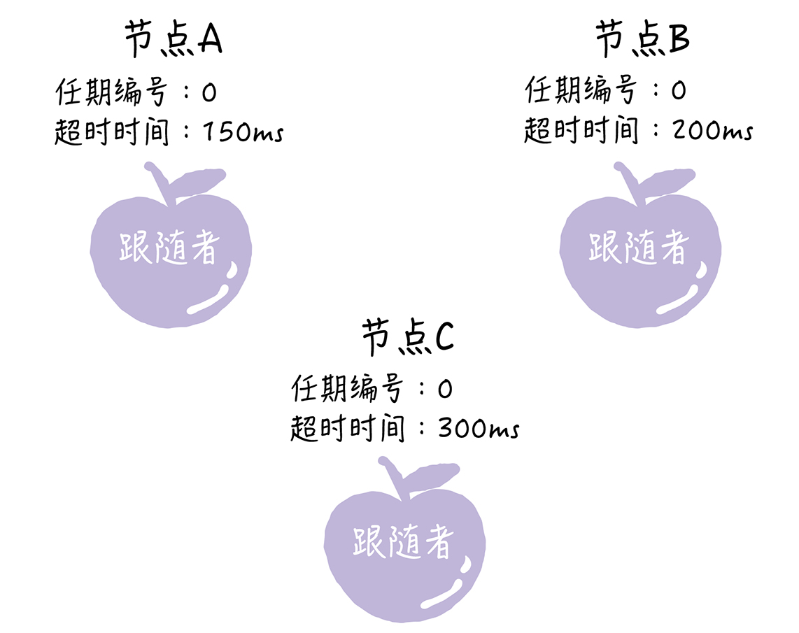
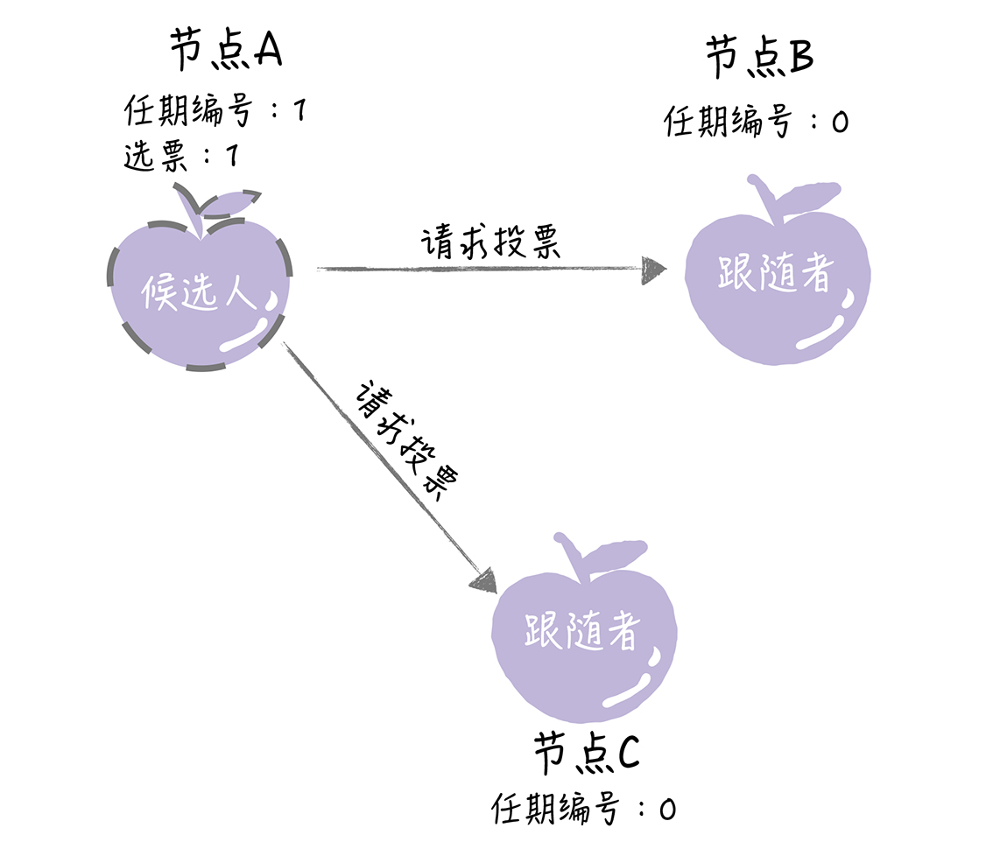
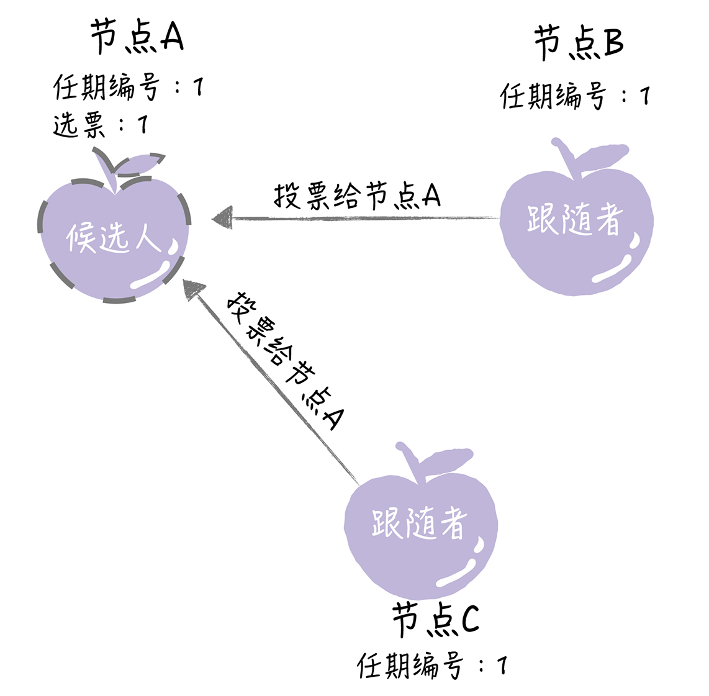
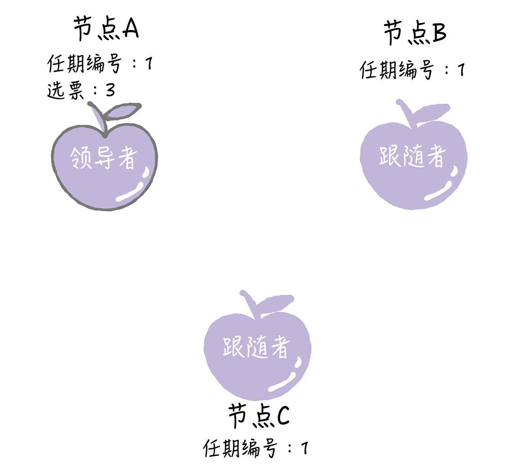
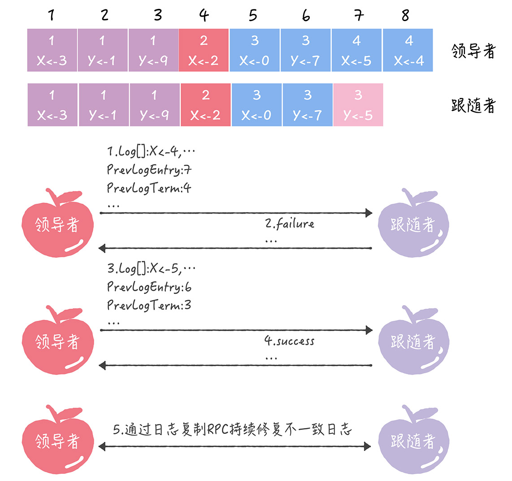

## 基础概念

### 一致性和共识性

#### 一致性（consistency）

 - 定义：分布式系统中各节点，执行一些列操作后，在约定协议下，对外呈现的状态是一致的。即**保证集群中所有节点中的数据完全相同并且能够对某个提案(Proposal)达成一致**。

   一致性不代表结果正确与否，而是系统对外呈现的状态一致与否。所有节点都达成失败状态也是一种一致

- 挑战
	- 节点之间的网络通讯是不可靠的，包括任意延迟和内容故障
	- 节点的处理可能是错误的，甚至节点自身随时可能宕机
	- 同步调用可以简化设计，但会严重降低分布式系统的可扩展性。
	
- 要求

  - **有限性**：达成一致的结果在**有限时间**内完成。
  - **约同性**：不同节点最终完成决策的结果是相同。
  - **合法性**：决策的结果必须是某个节点提出的方案。

- 分类

  - **严格一致性**： 对于数据项`X`的任何*读操作*将返回最近一次对`X`进行的*写操作*所对应的值；单机状态下才可能达到，分布式环境达不到
  - **强一致性**：当分布式系统更新操作完成后，任何多个进程或线程访问系统都会获得最新值。
  - 弱一致性：系统并不保证后续进程或线程的访问都会返回最新的更新值。系统在数据成功写入后，不承诺立即可以读到最新写入的值，也不会承诺多久之后可以读取到。但会尽可能保证在某个时间级别（比如秒级别）之后，可以让数据达到一致性状态。
  - **最终一致性**

- 算法：

  - 2PC
  
  - 3PC
  
  - TCC
  
- 使用场景：

  - 分布式事务
  
    

#### 共识（consensus）

- **定义**：分布式系统中多个节点间，相互对某个状态达成一致结果的过程。
- 算法

   - Paxos算法、Fast Paxos 算法、Cheap Paxos 算法、Raft 算法、ZAB 协议
- 使用场景
   - Leader选举
- **共识和一致性的区别**

  -  一致性**往往指分布式系统中多个副本***对外呈现的数据的状态\***。如顺序一致性、线性一致性，描述了多个节点对数据状态的维护能力。
-  **共识**描述了分布式系统中多个节点之间，彼此对某个状态达成一致结果的过程。
  -  **达到了共识不代表达到了一致性**
- 共识算法可以容忍小于一半的节点出现故障还能工作，分布式一致性算法要求所有的节点都同意后才提交；
  - 共识的最终的目标是所以节点达到一致性

### 实例

Zookeeper通过共识算法ZAB完成leader的选举，通过2PC完成数据的一致性

### 集群、主备、分布式

- 集群，主要为了提高计算能力和并发读的能力

  定义：**Cluster** : It means that multiple servers are grouped together to achieve the same business and can be regarded as one computer.

  特点：可扩展、高可用

  分类：高可用集群、负载均衡集群、科学计算集群

  - 微服务：相同的代码跑在不同机器上，提高并发处理能力
  - 存储：相同数据分布在不同的机器上，同步完成数据的一致性也就是强一致性，提高并发读的能力
  - 计算：计算任务请求多

- 主备，主要为了容灾

  - 存储：相同的数据分布在不同的机器上，异步完成树一致性
  
- 分布式，

   定义：**Distributed** : refers to splitting a business into different sub-services and distributing them on different machines.
  
  特点：大拆下
  
  分类：分布式数据库、分布式文件系统、分布式WebService、分布式计算
  
  - 微服务：一个大的业务拆分成不同的子业务不是在不同的机器上
  
  - 存储：不同的数据存储的不同机器上，提高并发写的能力
  
  - 计算：单个计算任务大，拆解再喝吧
  
    
  
  

## 拜占庭将军问题 The Byzantine Generals Problem

**解决的是共识问题**，不是一致性问题；计划达成了共识，然后执行计划，实现了一致行动。

在具体拜占庭问题中，只要达成进攻或者撤退的共识就行，不去考虑是否一起执行错了的指令，只要一起执行就行；

所以说拜占庭将军问题解法限制在特定场景

### 口信消息型拜占庭问题之解

限定：

A1.每个发送的消息都会被正确的传输；
A2.消息的接收者知道谁发送了消息；
A3.消息的缺席可以检测出来.

公式：

n 位将军，最多能容忍 (n - 1) / 3 位叛将，要进行（n-1）/3+1次询问

### 签名消息型拜占庭问题之解

限定：

在上面A1、A2、A3基础上增加以下两条限定

A4.忠诚的将军的签名不可以被伪造，他的签名信息的内容的任何改动都可以被检测;
A5.任何人可以验证签名的真实性.

## CAP理论

定义：CAP高度抽象了分布式特性，一致性、可用性、分区容错性

- C Consistency 一致性
- A Avaiablity 可用性
- P Partiion tolerance 分区容错性
- CA 模型，在分布式系统中不存在。因为舍弃 P，意味着舍弃分布式系统，就比如单机版关系型数据库 MySQL，如果 MySQL 要考虑主备或集群部署时，它必须考虑 P。
- CP 模型，采用 CP 模型的分布式系统，一旦因为消息丢失、延迟过高发生了网络分区，就影响用户的体验和业务的可用性。因为为了防止数据不一致，**集群将拒绝新数据的写入**，典型的应用是 ZooKeeper，Etcd 和 HBase。
- AP 模型，采用 AP 模型的分布式系统，实现了服务的高可用。用户访问系统的时候，都能得到响应数据，不会出现响应错误，但当出现分区故障时，相同的读操作，访问不同的节点，**得到响应数据可能不一样**。典型应用就比如 Cassandra 和 DynamoDB、Eurake。

CP模型的ACID理论，AP模型的BASE理论

## ACID 理论

- A Atomicity
- C Consistency
- I Isolation
- D Durability

### 单机ACID

以Mysql为例：

- A 原子性   通过UndoLog实现要么全部成功 要么全部失败
- D  持久性  通过RedoLog实现数据持久化一定成功
- I  隔离性   通过锁和MVVC
- C  一致性  通过AID保证一致性

### 分布式ACID

- 2PC

  - 准备阶段，锁定资源
  - 提交阶段，提交事务；

- 3PC

  - 准备阶段，同2PC
  - 预提交阶段
  - 提交阶段

  与2PC相比：

  - 降低了阻塞，如果参与者提预提交之后，如果协调者宕机或者网络出问题，自动提交
  - 解决了单点故障，如果参与者提预提交之后，如果协调者宕机或者网络出问题，自动提交

  与2PC共同存在的问题：

    数据不一致，网络故障时，如果需要回滚，会出现数据不一致

  

- TCC 

  业务层自己实现，复杂度高

## Base理论

base理论是CAP理论中AP的衍生，有以下两点核心

- 保证服务的基本可用

  具体措施有以下几点：

  - 流量削峰 如火车票  深圳8点开卖 北京9点开卖
  - 延迟响应 排队
  - 服务降级 保证核心功能可用
  - 过载保护  限流
  - 服务熔断  防止服务级联崩溃

- 保证服务的最终一致性

  有以下措施：

  - 读时修复，在读数据时通过多节点数据比对，发现数据不一致时进行修复；数据比对比较耗性能，这种方案比较少用；
  - 写时修复，在写入数据，检测数据的不一致时，进行修复；如果写失败就将数据缓存下来，然后定时重传，修复数据的不一致性，或者通过消息中间件
  - 异步修复，这个是最常用的方式，通过定时对账检测副本数据的一致性，并修复。

## Paxos算法

 paxos算法共识算法的代名词，Fast Paxos 算法、Cheap Paxos 算法、Raft 算法、ZAB 协议等等都是基于paxos改进的

- Basic Paxos

  角色：

  - 提议者 Proposer
  - 接受者 Acceptor
  - 学习者 Learner

  过程：

  - 准备阶段

    在准备请求中是不需要指定提议的值的，只需要携带提案编号就可以了，各接受者承诺不再接受小于该提案编号的提案。如果有一半及以上的接受者做出了响应，则发起第二阶段。

  - 提交阶段

    带上提案编号和提案值；接受者判断如果天编号小于之前承诺的则拒绝提案，否则接受提案；

    

  总结：

  - 通过两阶段提交实现的共识；我们设计新的共识算法时也可以考虑采用二阶段提交方式
  - 实现了容错，在少于一半的节点出现故障时，集群也能工作

  缺点：

  - 如果多个提议者同时提交提案，会导致提案冲突；比如5个节点，3个节点同时提交提案，永远无法确定天
  - 2轮通信，耗性能，延迟大

- Multi-Paxos

  针对Basic Paxos算法的缺点，特使是在多值设定时，第二个确定就更不能容忍了；所以有了Multi-Paxos算法

  定义：引入领导者（算法里没有具体定义领导者怎么选举），当领导者处于稳定状态时，省掉准备阶段，直接进入接受阶段；

  只有算法思想，没有具体实现

  

  - Chubby Multi-Paxos的具体实现

    - 通过Basic-Paxos算法选取领导者
    - 为了实现强一致性，读写都通过领导者节点

    我的理解Chubby和主备模式相比，就是完成了主挂掉后自动选一个主

## Raft算法

**特点**：

- Raft 算法属于 Multi-Paxos 算法，它是在兰伯特 Multi-Paxos 思想的基础上，做了一些简化和限制，比如增加了日志必须是连续的，只支持领导者、跟随者和候选人三种状态
- Raft 算法是现在分布式系统开发首选的共识算法；如Etcd、Consul、CockroachDB
- 本质上，Raft 算法是通过一切以领导者为准的方式，实现一系列值的共识和各节点日志的一致

**选举领导者过程**：

- 在初始状态下，集群中所有的节点都是跟随者的状态

  

​         Raft 算法实现了随机超时时间的特性。也就是说，每个节点等待领导者节点心跳信息的超时时间间隔是随机的

- 节点因为没有等到领导者心跳通知，发生超时；这时候节点会把自己的任期编号加1，推荐自己为候选者，向其它节点发起投票

  

- 如果其他节点接收到候选人 A 的请求投票 RPC 消息，在编号为 1 的这届任期内，也还没有进行过投票，那么它将把选票投给节点 A，并增加自己的任期编号。

- 如果候选人在选举超时时间内赢得了大多数的选票，那么它就会成为本届任期内新的领导者。

  

- 节点 A 当选领导者后，他将周期性地发送心跳消息，通知其他服务器我是领导者，阻止跟随者发起新的选举，篡权。

**选举规则**：

- 领导者周期性地向所有跟随者发送心跳消息（即不包含日志项的日志复制 RPC 消息），通知大家我是领导者，阻止跟随者发起新的选举
- 如果在指定时间内，跟随者没有接收到来自领导者的消息，那么它就认为当前没有领导者，推举自己为候选人，发起领导者选举。
- 在一次选举中，赢得大多数选票的候选人，将晋升为领导者。
- 在一个任期内，领导者一直都会是领导者，直到它自身出现问题（比如宕机），或者因为网络延迟，其他节点发起一轮新的选举。
- 在一次选举中，每一个服务器节点最多会对一个任期编号投出一张选票，并且按照“先来先服务”的原则进行投票。
- 当任期编号相同时，日志完整性高的跟随者（也就是最后一条日志项对应的任期编号值更大，索引号更大），拒绝投票给日志完整性低的候选人
- 跟随者等待领导者心跳信息超时的时间间隔，是随机的；
- 当没有候选人赢得过半票数，选举无效了，这时需要等待一个随机时间间隔，也就是说，等待选举超时的时间间隔，是随机的。

**日志格式**

- 指令：一条由客户端请求指定的、状态机需要执行的指令。你可以将指令理解成客户端指定的数据。
- 索引值：日志项对应的整数索引值。它其实就是用来标识日志项的，是一个连续的、单调递增的整数号码。
- 任期编号：创建这条日志项的领导者的任期编号。

**日志复制过程**

- 领导者进入第一阶段，通过日志复制（AppendEntries）RPC 消息，将日志项复制到集群其他节点上。
- 如果领导者接收到大多数的“复制成功”响应后，它将日志项提交到它的状态机，并返回成功给客户端。如果领导者没有接收到大多数的“复制成功”响应，那么就返回错误给客户端。（这里不再通知跟随者提交日志）
- 当其他节点接受领导者的心跳消息或者新的日志复制 RPC 消息（包含了当前最大的，将会被提交的日志项索引值）后，就会将这条日志项提交到它的状态机

**日志一致性保证**

- 领导者通过日志复制 RPC 消息，发送当前最新日志项到跟随者（为了演示方便，假设当前需要复制的日志项是最新的），这个消息的 PrevLogEntry 值为 7，PrevLogTerm 值为 4。

- 如果跟随者在它的日志中，找不到与 PrevLogEntry 值为 7、PrevLogTerm 值为 4 的日志项，也就是说它的日志和领导者的不一致了，那么跟随者就会拒绝接收新的日志项，并返回失败信息给领导者。

- 这时，领导者会递减要复制的日志项的索引值，并发送新的日志项到跟随者，这个消息的 PrevLogEntry 值为 6，PrevLogTerm 值为 3。

- 如果跟随者在它的日志中，找到了 PrevLogEntry 值为 6、PrevLogTerm 值为 3 的日志项，那么日志复制 RPC 返回成功，这样一来，领导者就知道在 PrevLogEntry 值为 6、PrevLogTerm 值为 3 的位置，跟随者的日志项与自己相同。

- 领导者通过日志复制 RPC，复制并更新覆盖该索引值之后的日志项（也就是不一致的日志项），最终实现了集群各节点日志的一致。

  

## 读写一致性保证

- 写都经由Leader节点处理
- 读，请求Follower节点，首先向Leader节点确认当前的logIndex,如果一直返回数据，如果不一致更新后在返回数据

### 节点的变更

**问题**

如果一次新增多个节点，发生分区错误时会出现两个Leader;如下图，A、B、C原本三个节点，新增两个节点D、E,此时发生了分区错误，A、B和C出现了网络不通，A、B未同步到新的配置，C同步到了新的配置；新增了以A、B为分区的多旧配置大多数，C、D、E为分区的新配置大多数；就出现A、C两个Leader

**解决办法**

单节点变更，每次变更一个节点，多次变更

## 一致性Hash

突破集群Leader节点写单点性能的限制，通过一致性Hash算法构建多集群