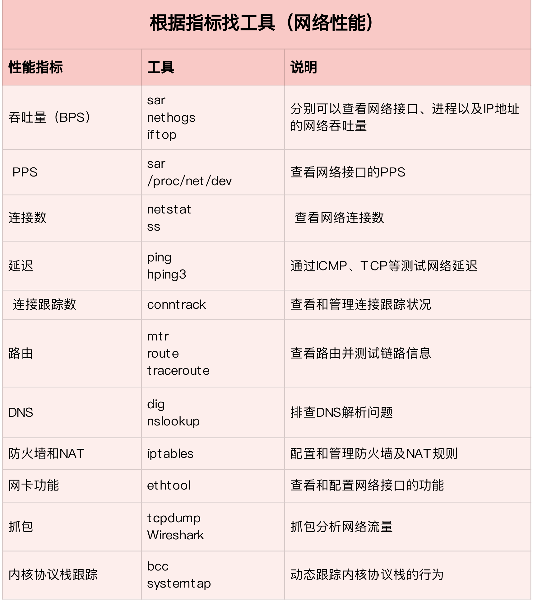
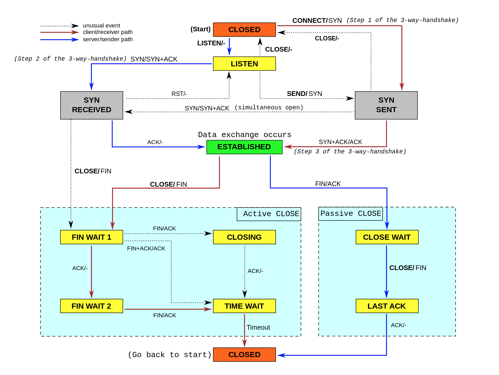

# Linux-性能优化

## 性能工具集

## 上下文切换

vmstat

- cs（context switch）是每秒上下文切换的次数。
- in（interrupt）则是每秒中断的次数。
- r（Running or Runnable）是就绪队列的长度，也就是正在运行和等待 CPU 的进程数。
- b（Blocked）则是处于不可中断睡眠状态的进程数。

sysstat包下的pidstat

- cswch(voluntary context switches):自愿上下文切换，是指进程无法获取所需资源，导致的上下文切换。比如说， I/O、内存等系统资源不足时，就会发生自愿上下文切换。
- nvcswch（non voluntary context switches):非自愿上下文切换，则是指进程由于时间片已到等原因，被系统强制调度，进而发生的上下文切换。比如说，大量进程都在争抢 CPU 时，就容易发生非自愿上下文切换。

## CPU

查看cpu使用top、pidstat 1 5

查看占用cpu时间程序：perf 

cpu的性能指标

cpu性能指标工具

## Memory

memory性能指标

memory工具

## IO

IO指标

IO工具

## 网络

指标

工具

网络优化的几种方式：

应用层：

- 使用长连接取代短连接，可以显著降低 TCP 建立连接的成本。在每秒请求次数较多时，这样做的效果非常明显。
- 使用内存等方式，来缓存不常变化的数据，可以降低网络 I/O 次数，同时加快应用程序的响应速度。
- 使用 Protocol Buffer 等序列化的方式，压缩网络 I/O 的数据量，可以提高应用程序的吞吐。
- 使用 DNS 缓存、预取、HTTPDNS 等方式，减少 DNS 解析的延迟，也可以提升网络 I/O 的整体速度。

Socket层：

- 优化套接字的缓冲区大小

**NAT原理**

网络中的多台主机，通过共享同一个公网 IP 地址，来访问外网资源。同时，由于 NAT 屏蔽了内网网络，自然也就为局域网中的机器提供了安全隔离

NAT 的主要目的，是实现地址转换。根据实现方式的不同，NAT 可以分为三类：

- 静态 NAT，即内网 IP 与公网 IP 是一对一的永久映射关系；
- 动态 NAT，即内网 IP 从公网 IP 池中，动态选择一个进行映射；
- 网络地址端口转换 NAPT（Network Address and Port Translation），即把内网 IP 映射到公网 IP 的不同端口上，让多个内网 IP 可以共享同一个公网 IP 地址

## TCP 

优化：

