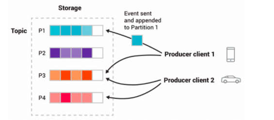

## 分布式消息队列

 ### Kafak( https://kafka.apache.org/documentation/)



 核心概念：

- **producers** 消息生产者
- **consumers** 消息消费者
- **parition**,也就quenue,存储数据的队列; 一个消费者可以消费对个parition,但是一个parition这能被一个消费者消费；一个生产者也只写入一个parition
- **topic**，生产者分组的概念，一个topic包含多个parition

- **consumer group** 一组相同的消费者；同一个组里的消费者通过动态平衡算法决定哪个消费者对应哪个parition

### PMQ (https://github.com/ppdaicorp/pmq)

轻量级、使用java编写，借鉴了kafak、qmq的思想，不同的没有自己实现存储，采用了数据，动态平衡算法使用了简单的实现，适合适合消息系统的入门的学习

### RocketMq (https://rocketmq.apache.org/docs/motivation/)

## 微服务四大难题

### 数据一致性分发问题

先看下面代码

```java
@Transactional
public void saveOrder(OrderInfo orderInfo){
  try{
    boolean result=dao.save(orderInfo);
    if(result){
      mq.send(orderInfo);
    }
  }
  catch(Exception ex){
    throw ex;
  }
}
```

上面的代码能保证事务性？ 答案是不能的，mq.send() 抛出了exception不代表消息一定发送失败，可能是网络问题；最终可能导致消息发送成功，数据库操作回滚

如何保证实事务性呢？

#### 解决方案一：事务性发件箱（Transactional OutBox）

由ebay最先提出的事务性发件箱，利用本地事务，再写入订单表的同时，在本地库写入一条订单产生记录表，然后由一个第三方服务来拉出订单产生记录发送消息，发送消息失败会重试，直到成功或超过重试次数; 保证了At leatest once,但可能重复，消费方注意幂等

Transactional OutBox的框架代码实现：https://github.com/killbill/killbill-commons/tree/master/queue

#### 解决方案二：变更数据捕获（Change Data Capture,CDC）

由一个Transaction log miner捕获数据库的Transaction log,然后发送消息。例如mysql的binlog

开源的Transaction log miner实现：

阿里Canal:https://github.com/alibaba/canal

RedHat Debezium:https://github.com/debezium/debezium

Zendesk Maxwell:https://github.com/zendesk/maxwell

Airbnb SpinalTap:https://github.com/airbnb/SpinalTap

#### 解决方案三：借助事务消息系统

借助如RocketMq等支持事务消息的消息系统

### 数据Join问题

#### 解决方案一：字段冗余

通过冗余查询需要的字段，避免join;如果冗余字段对准确性要求高，需要注意的时要订阅冗余字段的更新

#### 解决方案二：引入聚合服务层BBF

通过增加一层BBF,在内存中聚合多个服务返回的数据；缺点是可能需要对有些服务访问N次，如果对多个服务都有分页查询需求就无法实现了

#### 解决方案三：通过CDC计数，对需要的数据实时聚合

通过上面提到的Canal的CDC计数，捕获动态变更的数据，对需要的数据实时聚合，然后放入cassandra、es等进行快速查询

### 分布式事务问题

分布式事务通过的解决方案指导思路的2PC,目前有多个实现，如XA，阿里Seata的AT模式

#### 解决方案一： XA协议

要求数据库支持XA协议，目前mysql的XA协议性能不好解决

#### 解决方案二：Seata的AT模式

只需要数据库支持本地事务就行；通过解析Sql语句，生成rollback 语句，利用本地事务和业务数据在一个事务里写到本地数据库中；通过一个集中式Seata Server,也叫TC，做分布式式下临界资源访问控制；第一个阶段准备阶段，每个RM向TC申请资源的修改权限，在第二阶段TM根据第一阶段的结果决定是提交还是回滚；TM在应用程序内，由聚合层服务充当，RM可以理解为每个单表的dao层

#### 解决方案三：Seate的TCC模式

不需要数据库支持本地事务，如同时写入mysql和es的场景；需要业务层自己实现TCC逻辑；如机票预订等场景

#### 解决方案四：Sega模式，阿里的Seata,Uber的 [cadence](https://github.com/uber/cadence)

长事务模式，通过DSL定义流程，通过解析引擎来执行；将全局事务建成一组本地ACID事务，引入事务补偿机制处理失败场景

https://microservices.io/patterns/data/saga.html

https://seata.io/zh-cn/docs/user/saga.html

#### 微服务时代的事务处理原则

- 假定网络或者服务不可靠
- 将全局事务建模成一组本地ACID事务
- 引入事务补偿机制处理失败场景
- 事务始终处在一种明确的状态
- 最终一致性
- 考虑隔离性
- 考虑幂等性
- 异步响应式，尽量避免直接同步调用