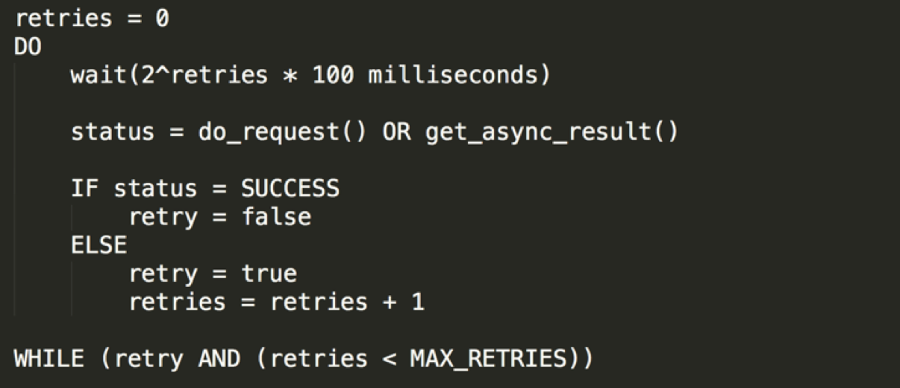

## 掌门用户中心稳定性探索和实践


> Failures are a given, and everything will eventually fail over time  --  Werner Vogels, CTO at Amazon 

## 背景

用户中心作为掌门最基础、最核心的底层服务；一旦服务不可用，将导致学生和老师无法进入课堂，造成不好的用户体验、新用户无法注册，导致用户的流失。就像Amazon的CTO  Werner Vogels所说，失败总会发生，那么当失败发生时系统是个什么样的状态，如何快速恢复是我们接下来要去探索的。

## 面临的挑战

- 历史遗留问题多

- 牵涉关联方多

- 稳定性要求高

- 性能要求高

## 探索过程

### 整体思路


本文着重讲述在掌门用户中心稳定探索过程中我们在应用架构设计和容灾测试两个方面做的探索。

### 应用设计

**一、服务的可用性**

1、冗余；多节点部署、异地部署


对于服务的可用性有一个这样的计算公式：A=1-(1-AX)^2;对应计算结果如下


2、服务健康检测

 服务检测分为两种，一种是主动检测，用于我们随时查看服务健康状态；一种是被动通知，服务不可用及时通知。

I.主动检测服务健康目前在掌门有两种方式，一种通过注册中心查看服务状态，一种是定时调用服务的health_check接口

1)通过掌门CD系统查看，如下图


2）通过promethues监控系统查看，如下图


II.被动通知

掌门CD系统可以配置应用健康告警、注册中心告警，能够自定义告警渠道和告警级别

**二、弹性架构**

弹性指的是系统能够优雅地处理错误并且能够快速高效地恢复正常运转。要做到弹性需要从资源隔离、断路器、重试几个方面入手。

弹性框架目前开源界有三个可选方案，分别是Hystrix、Resilience4j、Sentinel;如何进行选择呢，下面我们来进行一些比较：

Hystrix在Spring Cloud中有很好的封装，和Feign配合起来使用非常便捷，但是官方宣布不再继续更新，推荐新项目使用Resilience4j。
Resilience4j是一个十分轻量级的容错库，提供函数式和响应式风格的 API，增加了 rate limiting 和 automatic retrying 两个模块，适合用在中间件服务中，比如我们自研的网关服务就是使用Resilience4j来做的熔断和重试。Sentinel相比Hsytrix和Resilience4j有个很大的优势，提供了界面化的配置管理和实时监控页面，配置的存储可以支持Apollo、Nacos等；配置随时修改随时生效对于企业服务来说很有吸引力；所以在用户中心我们最终选择了Sentinel作为弹性框架。

**I.资源隔离(Bulkhead)**

资源隔离的作用是服务里的一个组件出现了错误，其它的组件能够正常工作不受影响


常见的资源隔离方式有基于线程池和信号量的隔离；基于线程池的隔离比较重量级，会使程序的线程的模型变的复杂；基于信号量的隔离比较轻量级，但是无法设置超时，不过超时有很多其他的办法来实现，所有最终我们采用了基于信号量隔离的方式。

**II.断路器(Circuit Breaker)**

在用户中心使用Sentinel作为断路器中间件，使用在了以下两个方面：

1.接口层通用配置

1）.通过一个javax.servtlet.Filter把所有的Http请求用 Sentinel API `SphU.entry("")` 和 `entry.exit()` 包围起来封装成Sentinel的资源，之后可以在管理后台为所有Http请求配置熔断规则；Sentinel提供对应的功能模块，我们在引用中引入下方jar即可；当本服务部分资源有问题时及时熔断，避免级联故障。

```xml
<dependency>
  <groupId>com.alibaba.csp</groupId>
  <artifactId>sentinel-web-servlet</artifactId>
  <version>x.x.x</version>
 </dependency>
```

2）自定义熔断降级逻辑；我们实现一个com.alibaba.csp.sentinel.adapter.servlet.callback.UrlBlockHandler类，如果是POST请求，会落地本次请求数据到另外一个容灾备库，并根据配置写入此次请求时候可以使用JOB自动发起重试；如果是GET请求则封装成项目里的统一返回结构，数据为空，提示消息为接口被熔断；

2.在Repostory层方法上使用SentinelResource注解，针对外部资源的访问比如数据库、外部服务接口、磁盘IO的操作封装成Sentinel的资源；当外部依赖资源出现问题时及时熔断，避免级联故障。并且根据不同的接口做不同策略的降级处理，比如写容灾备库失败，使用的策略是写日志、敏感词校验服务调用失败,使用策略是跳过本次校验发送告警消息。

**III.重试**

重试能够减少网络抖动所带来的影响，重试的伪代码如下：




**三、服务性能**

如果优化系统性能时，只是依据自己的经验，对感觉存在性能提升空间的代码，无一例外地做一遍优化，这既是一件事倍功半的事，也很容易遗漏下关键的优化点，无法大幅提升系统的性能。根据二八定律，只有优化处于性能瓶颈的那些少量代码，才能用最小的成本获得最大的收益。然而，找到性能瓶颈却不是一件容易的事。我们通常会采用各种监控手段来发现性能瓶颈，但如果监控动作自身的开发成本过高，或者施行监控时显著降低了业务请求的性能，或者无法全面覆盖潜在的问题，都会影响性能优化目标的实现。

在用户中心的性能优化过程中，我通过了下面两个步骤来做性能优化：

1.单机查找性能瓶颈神器---火焰图

在本地查找性能瓶颈最直接有效的方式，就是从代码层面直接寻找调用次数最频繁、耗时最长的函数，通常它就是性能瓶颈；我们很难通过review代码的方法来发现，需要借助工具；火焰图是linux性能大师Brendan Gregg 发明的，具有没有代码侵入性、覆盖到代码中的全部函数、搭建环境的成本足够低等特点；下面先来直接感受下火焰图的样子：


火焰图中最重要的信息，就是表示函数执行时间的 X 轴，以及表示函数调用栈的 Y 轴。

X 轴由多个方块组成，每个方块表示一个函数，其长度是定时采样得到的函数调用频率，因此你可以简单粗暴地把它近似为执行时间

Y 轴它表示函数的调用栈。这里，我们既可以看到内核 API 的函数调用栈，也可以看到用户态函数的调用栈，非常强大；如果你正在学习开源组件的源码，你可以先生成火焰图，再对照图中的 Y 轴调用栈，理解源码中函数的调用关系。

火焰图的生成方式：

1).在掌门内部CD平台上集成了去哪儿开源的工具Bitoury;在Bitoury管理后台 主机信息》性能分析 菜单下可以直接得到火焰图；Bittoury还有更多实用的功能，如果你感兴趣，可以去文末的链接里查看更多实用说明

2).使用开源工具async-profiler；地址：https://github.com/jvm-profiling-tools/async-profiler

2.集群下查找性能瓶颈

通过全链路监控工具Skywalking、cat等来发现慢接口，慢sql;

### 容灾测试

在系统实际运行过程中可能会出现各种各样的异常情况；比如进程Hang主、经常被杀、依赖超时、依赖异常、业务线程池满、OOM、数据库宕机、数据库连接满、数据库主备同步延迟、网络丢包、网络超时、磁盘满等

前面虽然做了优化设计，但是这些场景很难在真实环境出现,一旦出现都将是严重的事故；怎么证明我们前面的改造是有效的、怎么知道出现这些异常后我们的系统表现是怎样的?

我们可以借助混沌工程来达到上述目的；先来看下混沌工程是什么，混沌工程是指通过主动制造故障，测试系统在各种压力下的行为，识别并修复故障问题，避免造成严重后果。

**混沌工程技术选型**

目前开源的方案有：Netflix的Chaos Monkey、阿里巴巴的ChaosBlade、PingCAP的ChasoMesh、codecentric的chaos-monkey-spring-boot；基于易用性和代码无侵入性两个方面考虑；我们最终选用了阿里巴巴开源的ChaosBlade。

阿里巴巴开源的ChaosBlade;项目地址：https://github.com/chaosblade-io/chaosblade

使用方法

- 为了避免对我们的依赖方造成影响，我们使用Doker搭建一套容灾测试环境;搭建脚本如下

  ```shell
  FROM centos:latest
  MAINTAINER shitao.gan
  # set env
  WORKDIR /opt/settings/
  RUN echo 'env=FAT' > server.properties
  RUN echo 'image created'
  ENV eureka.client.registerWithEureka false
  # add yum
  RUN  curl -O /etc/yum.repos.d/CentOS-Base.repo http://mirrors.aliyun.com/repo/Centos-7.repo \
      && yum clean all \
      && yum makecache \
      && yum install -y zip \
                      wget \
                      crontabs  \
                      telnet-server  \
                      telnet.*  \
                      java-1.8.0-openjdk-devel \
                      man \
                      net-tools \
                      tc \
                      sudo \
      && mkdir /usr/local/apps
  WORKDIR /usr/local/apps
  RUN wget -d -t 0 https://chaosblade.oss-cn-hangzhou.aliyuncs.com/agent/github/0.6.0/chaosblade-0.6.0-linux-amd64.tar.gz
  # copy jar; xxx.jar是我们要运行的服务
  ADD /target/xxx.jar /usr/local/apps/
  EXPOSE 8080
  CMD java -jar xxx.jar
  
  ```

- 使用ChaosBlade进行容灾演练

  ```shell
  #模拟CPU满载；
  blade create cpu load
  #模拟进程挂掉
  blade create process kill --process-cmd java
  #模拟数据库挂掉
  blade create network loss --percent 100 --interface eth0 --remote-port 3306 --destination-ip 14.215.177.39
  #模拟Redis挂掉
  blade create network loss --percent 100 --interface eth0 --remote-port 6379 --destination-ip 14.215.177.28
  #模拟外部服务挂掉
  blade create network loss --percent 100 --interface eth0 --remote-port 8080 --destination-ip 14.215.177.11
  #模拟外部服务响应慢
  blade create network delay --time 3000 --interface eth0 --remote-port 8080 --destination-ip 
  ```

在此次测试过程中我们发现了一些问题，在这里记录几个，避免大家遇到相同问题

1）Sentinel熔断不生效

   现象：在对数据库熔断的处理过程中，我们使用SentinelResource注解。配置了降级方案后发现降级策略没有生效

   原因分析：排查过程中发现了SentinelResource注解方法和调用方在相同的类中，同类调用，导致注解失效

   解决方案：把SentinelResource注解的方法抽取到一个单独类。在使用Transcational 、Aysnc等注解是要注意同样问题

2）Hystrix超时不生效

  现象：在测试外部接口超时过程中，发现外部接口响应时间未超过配置的超时时间，Hystrix却报了超时错误。

  原因分析：配置了feign.client.config.default.connectTimeout和feign.client.config.default.readTimeout，忽略掉了hystrxi线程超时的配置

  解决方案：配置hystrix.command.default.execution.isolation.thread.timeoutInMilliseconds

通过这次容灾测试我们了解了系统在各种异常情况的状态、发现了系统的在极端情况情况下的问题、提高了系统的健壮性

## 总结

很多时候生产出现问题时，往往都是我们第一次看到这种错误，所以我们会手足无措，无从下手；事前演练，做好错误发生时降级方案，当生产真正出现错误时我们才能从容的去面对。


## 作者简介
- 甘世涛:掌门业务系统研发部-资深后端开发工程师；曾在携程、阿里云担任研发工程师；现在掌门负责流程中心、微服务编排、规则引擎、唯一ID、微服务网关等基础平台研发。


## 参考资料

- [resilience4j](https://resilience4j.readme.io/docs/)
- [chaosblade-help-zh-cn](https://chaosblade-io.gitbook.io/chaosblade-help-zh-cn/)
- [Sentinel](https://sentinelguard.io/zh-cn/docs/introduction.html)
- [bistoury](https://github.com/qunarcorp/bistoury)

